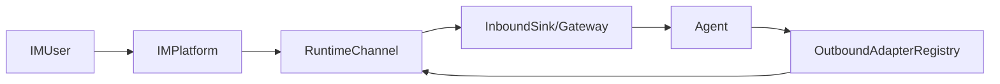

# Channels 概览与架构说明

OctopusClaw 通过 **Channel（通道）** 将 WhatsApp / Telegram / Feishu / DingTalk / Slack / Discord 等 IM 平台接入到同一套 Agent 能力中。本文件概述通道相关的核心概念与数据流。

## 核心概念

- **ChannelPlugin (`pkg/channels/*/plugin.go`)**  
  - 仅包含 ID、名称、文档路径等元信息，用于 Control UI 展示和 Gateway 方法注册。  
  - 由 `pkg/channels/builtin/register.go` 统一注册。

- **OutboundAdapter (`pkg/channels/*/adapter.go`)**  
  - 负责“**单条发送**”能力，供 Gateway 的 `send` / `chat.send` 等方法调用。  
  - 由 `pkg/outbound.AdapterRegistry` 管理，例如 `dingtalk.Adapter`、`feishu.Adapter`。

- **RuntimeChannel (`pkg/channels/runtime.go`)**  
  - 通道“**运行时**”抽象，负责：  
    - 与外部 IM 建立长连接（如 Feishu WebSocket）、处理回调或轮询。  
    - 将入站消息封装为 `InboundMessage` 并交给 Gateway / Agent。  
    - 在需要时发送回复消息（可复用 OutboundAdapter 或直接调用 SDK）。
  - 由各 IM 子包实现，例如：  
    - `feishu.Runtime`（WebSocket 收消息）  
    - `telegram.Runtime` / `whatsapp.Runtime` / `dingtalk.Runtime`（当前为骨架）  
    - `slack.Runtime` / `discord.Runtime`（当前为骨架）。

- **ChannelManager (`pkg/channels/manager.go`)**  
  - 持有多个 `RuntimeChannel` 实例，统一管理其生命周期（`Start/Stop/List/Status`）。
  - 当前由 `gateway/http.Server` 创建并挂载到 `handlers.Context.ChannelManager`。

- **InboundSink (`pkg/channels/runtime.go`)**  
  - RuntimeChannel 将 `InboundMessage` 投递给 Gateway 的统一接口。  
  - 当前实现为 `gateway/http/hooksAgentSink`：  
    - 把 `InboundMessage` 转换为一次 `HooksAgentParams` 调用，相当于内部触发 `/hooks/agent`。

## 数据流（简要）

- **入站（IM → Agent）**  
  1. 用户在 IM 中给机器人发消息。  
  2. 对应 `RuntimeChannel`（例如 `Feishu.Runtime`）通过 WebSocket / 回调收到事件。  
  3. 运行时解析消息（私聊/群组、@ 机器人、白名单等），构建 `InboundMessage`。  
  4. `BaseRuntimeImpl.PublishInbound` 调用 `InboundSink.Deliver`（当前为 `hooksAgentSink`）。  
  5. `hooksAgentSink` 生成 `HooksAgentParams`，通过 `ctx.HooksAgent` 内部触发一个 Agent 回合。

- **出站（Agent → IM）**  
  - 简单路径：`send` / `chat.send` → `outbound.AdapterRegistry` → 各 Channel 的 `Adapter.SendText/SendMedia`。  
  - 运行时路径（逐步扩展中）：Agent 也可通过更高层接口调用 RuntimeChannel 的 `Send` / `SendStream`。

## 当前已实现的 Runtime

- **Feishu** (`pkg/channels/feishu/runtime.go`)  
  - 使用 `larksuite/oapi-sdk-go/v3/ws` 建立 WebSocket 长连接。  
  - 支持：  
    - 文本、图片、富文本（post）解析。  
    - 群聊中仅在 @ 机器人时才触发。  
    - 允许列表（`allowedIds`）过滤。  
    - 通过 `hooksAgentSink` 将消息桥接到 Agent。  
    - 复用 Feishu HTTP 客户端发送 Markdown 卡片和图片。

- **Telegram / WhatsApp / DingTalk / Slack / Discord**  
  - 在各自子包下有 `runtime.go` 骨架，实现了 `RuntimeChannel` 的最小占位版本：  
    - `Start/Stop`：委托给 `BaseRuntimeImpl`。  
    - `Send/SendStream`：当前为空实现，后续可接入各平台官方 SDK 或桥接服务。

后续可以按需依次为这些骨架 Runtime 补充完整的 SDK 集成与入站消息桥接逻辑。

